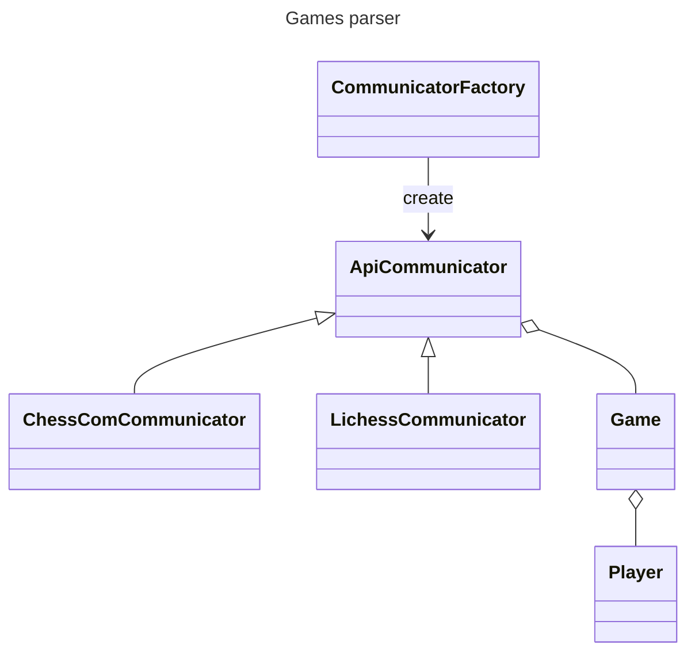

[](https://github.com/pre-commit/pre-commit)

# Chess stats

# [demo](https://michalskibinski109.github.io/chess-stats/)

## description

Create reports from your chess games that you played on `chess.com` and `lichess.org` for free. Track your progress and improve your game. Check your win ratio per opening,
per time control,per day of the week, check in which stage of the game you are losing the most, and much more.

## installation

### 1. Configure and run server

```bash
git clone https://github.com/michalskibinski109/chess-stats.git; cd chess-stats;  python -m pip install -r requirements.txt; python  ./chess_stats/manage.py migrate; python  ./chess_stats/manage.py runserver
```

### 2. Run worker
```bash
 cd chess-stats; python -m ./chess_stats/manage.py qcluster
```


### 3. Optionall

If you want stockfish engine to analyze your app and enable some more features, you need to download it from [here](https://stockfishchess.org/download/) and put it in the project folder.

### 4. That is it
Server is runnig in [localhost](localhost:8000) and you can use it.

## Architecture.

Project is separated into 2 different repositories.
1. [chess-insight](https://github.com/michalskibinski109/chess_insight) - Low level library that handles communicating with apis and parses games.
2. chess-stats (This project) Provides server and plotting charts basing on the data from (1.)
 
### architecture




## Note

In this project I use logger from my other package. You can check it [here](https://github.com/michalskibinski109/miskibin) if you want to use collored logs in your project.
