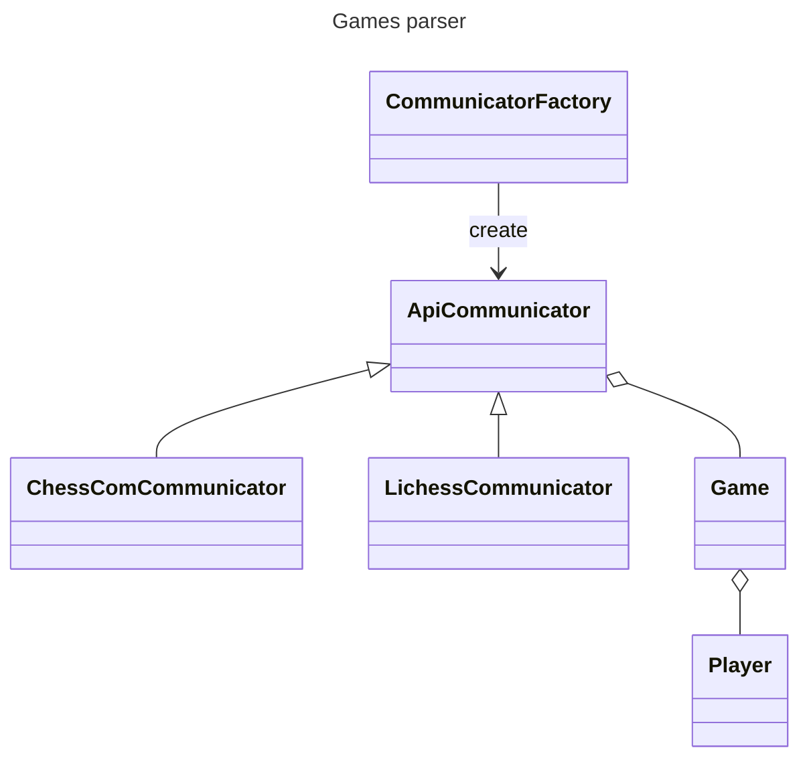
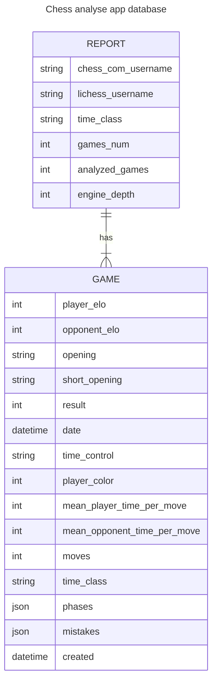

[](https://github.com/pre-commit/pre-commit)

**project still under development**

# chess_analyse_app

# [demo](https://michalskibinski109.github.io/chess_analyse_app/)

## description

Create reports from your chess games that you played on `chess.com` and `lichess.org` for free. Track your progress and improve your game. Check your win ratio per opening,
per time control,per day of the week, check in which stage of the game you are losing the most, and much more.

## installation

### 1. Configure and run server

```bash
git clone https://github.com/michalskibinski109/chess_analyse_app.git;
cd chess_analyse_app; python -m pip install -e .; python -m pip install -r requirements.txt;
python -m ./src/server/manage.py migrate; python -m ./src/server/manage.py runserver
```

### 2. Run worker
```bash
python -m ./src/server/manage.py qcuster
```


### 3. Optionall

If you want stockfish engine to analyze your app and enable some more features, you need to download it from [here](https://stockfishchess.org/download/) and put it in the project folder.

### 4. That is it
Server is runnig in [localhost](localhost:8000) and you can use it.


## how does it work

1. send get request to chess.com api with given username to get all of the player games
2. convert png strings to python objects
3. convert python objects to dataframe
4. show all of information about games on charts using django web app. (In progress)

### example output for single game parsed by `games_parser` module:

```
Game:
  player_elo: 1399
  opponent_elo: 1335
  opening: Bishop's Opening: Vienna Hybrid
  short_opening: Bishop's Opening
  result: 0
  date: 2022-10-05 16:23:40
  time_control: 5+5
  player_color: 0
  mean_player_time_per_move: 6.0
  mean_opponent_time_per_move: 7.01
  moves: 24
  time_class: blitz
  phases: (9, 47, 47)
  mistakes: [(0, 2, 0), (1, 1, 5), (0, 0, 0)]
```

- `phases` - tuple of 3 values, first value is number of moves in opening, second value is number of moves in middle game, third value is number of moves in end game
- `mistakes` - tuple of 3 values, first value is number of mistakes in opening, second value is number of mistakes in middle game, third value is number of mistakes in end game


### architecture




### database





## Note

In this project I use logger from my other package. You can check it [here](https://github.com/michalskibinski109/miskibin) if you want to use collored logs in your project.
