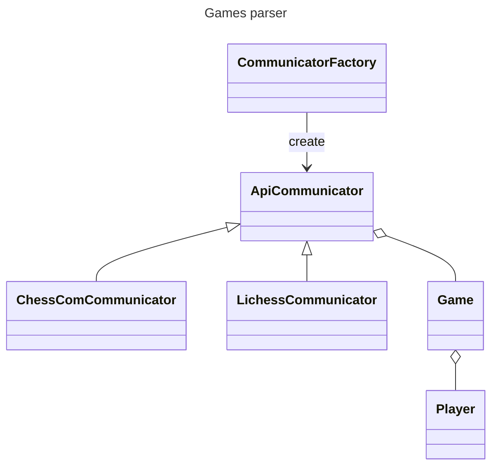
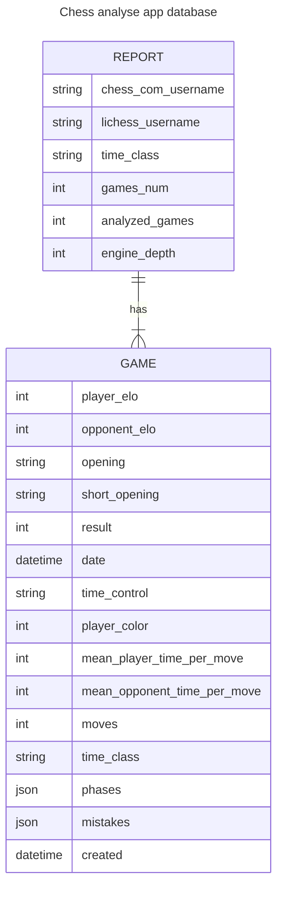

**project still under development**

# chess_analyse_app

1. [Description](#description)
2. [Installation](#installation)
3. [Usage](#usage)
4. [examples](#examples)
5. [how does it work](#how-does-it-work)

## description

Create reports from your chess games that you played on `chess.com` and `lichess.org` for free. Track your progress and improve your game. Check your win ratio per opening,
per time control,per day of the week, check in which stage of the game you are losing the most, and much more.

## installation


```bash
git clone https://github.com/michalskibinski109/chess_analyse_app.git
cd chess_analyse_app
pip install -e .
pip install -r requirements.txt
```

### Optionall

If you want stockfish engine to analyze your app and enable some more features, you need to download it from [here](https://stockfishchess.org/download/) and put it in the project folder.

## usage

to initialize database (you need to do it only once)

```bash
python src/server/manage.py makemigrations; python src/server/manage.py migrate
```

to run server

```bash
python src/server/manage.py runserver
```

to run queuing system

```bash
python src/server/manage.py qcluster
```

## examples

### create report (you don't need to be logged in)


### view statistics


### You can check all reports...


### ... and get list of games that are in report


## how does it work

1. send get request to chess.com api with given username to get all of the player games
2. convert png strings to python objects
3. convert python objects to dataframe
4. show all of information about games on charts using django web app. (In progress)

### example output for single game parsed by `games_parser` module:

```
Game:
  player_elo: 1399
  opponent_elo: 1335
  opening: Bishop's Opening: Vienna Hybrid
  short_opening: Bishop's Opening
  result: 0
  date: 2022-10-05 16:23:40
  time_control: 5+5
  player_color: 0
  mean_player_time_per_move: 6.0
  mean_opponent_time_per_move: 7.01
  moves: 24
  time_class: blitz
  phases: (9, 47, 47)
  mistakes: [(0, 2, 0), (1, 1, 5), (0, 0, 0)]
```

- `phases` - tuple of 3 values, first value is number of moves in opening, second value is number of moves in middle game, third value is number of moves in end game
- `mistakes` - tuple of 3 values, first value is number of mistakes in opening, second value is number of mistakes in middle game, third value is number of mistakes in end game


### architecture




### database





## Note

In this project I use logger from my other package. You can check it [here](https://github.com/michalskibinski109/miskibin) if you want to use collored logs in your project.
